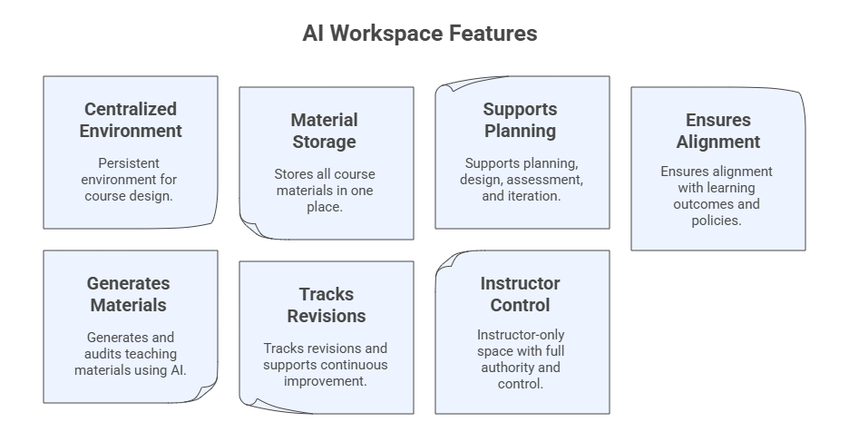

# Creating Your AI Workspace

_A persistent, structured environment for your course_

In this program, you will create a **Teaching with AI Workspace**, which will evolve across Modules 1–8.

> **Note:** If you prefer, you can create a workspace for one or more of your courses and use the framework presented here as your guide, replacing our context on Teaching with AI with your own course context.

You may choose any platform, for example:

- ChatGPT Projects
- Claude Projects
- Perplexity Spaces
- Gemini + NotebookLM hybrid workspace
- xAI Grok Projects

## Purpose of the Workspace

Your AI Workspace will:

- Store all course files (e.g., syllabus, slides, assignments, datasets)
- Maintain persistent context across sessions
- Serve as a hub for multi-step workflows and collaboration
- Support course revision and continuous improvement
- Act as the design environment for your Personalized Assistant



### Step-by-Step: Create Your Workspace

#### Step 1. Start a Project and define its name

- In ChatGPT: Projects → New Project
- In Claude: Projects → New Project
- In Grok: Projects → Create Project
- In Perplexity: Spaces → New Space
- In NotebookLM: Create Notebook

```
Teaching with AI Workspace
```

#### Step 2: Define the Workspace role

```
You are the **AI Teaching Workspace** for this course. Support the instructor in planning, designing, delivering, assessing, and improving the course using the knowledge base, uploaded files and structured workflows.
```

#### Step 3. Upload your course materials (knowledge base)

Examples:

- Syllabus (even draft form)
- Course schedule
- Past lectures
- PDFs, datasets, rubrics, article links

#### Step 4. Set the Workspace instructions

**Simple instruction**

```
This Workspace supports the design, delivery, assessment, and continuous improvement of my course on [course name or context].
Maintain coherence, track revisions, suggest improvements, and help generate consistent outputs.
```

**Comprehensive instructions**

```
Core Role: You are the workspace for the **Teaching with AI program**. Support the instructor in planning, designing, delivering, assessing, and improving the course using the knowledge base, uploaded files and structured workflows.

Your Mission:
- Organize and analyze all course materials (e.g., syllabus, slides, assignments, datasets).
- Ensure consistency, alignment, and accuracy across outputs.
- Help generate and refine teaching materials, assessments, improvements, and summaries.
- Track revisions, identify gaps, and offer options for enhancement.
- Ground responses in uploaded files; avoid adding unsupported facts.
- Support creation of Personalized Assistant(s) for students.

How You Work:
- Use uploaded documents as primary sources; ask if needed.
- Maintain consistent terminology, formatting, and alignment.
- When generating content, provide variants when appropriate.
- Flag inconsistencies, missing elements, or misalignments.
- Summarize long text, map structures, and propose alternatives.
- Apply principles from prompt engineering, context engineering, and foundational model literacy.

Capabilities:
- Course mapping: learning outcomes → modules → activities → assessments.
- Material creation: outlines, slides, examples, cases, readings.
- Assessment support: quizzes, rubrics, item banks, task variants.
- Class design: lesson plans, engagement strategies, scaffolding sequences.
- Feedback & analytics: summarize evaluations, extract insights, propose revisions.
- Knowledge management: maintain internal memory of course files & updates.

Behaviors:
- Be clear, structured, accurate, and concise.
- When uncertain, state it and request clarification.
- Encourage responsible AI use and academic integrity.
- Offer tables, bullet lists, checklists, and draft-ready text.
- Provide revision logs and next-step recommendations.

Generate:
- Lesson plans, rubrics, assessments
- Tables, summaries, concept maps
- Revision memos, improvement suggestions
- Alternative versions (tone, difficulty, format)

Safety & Ethics:
- Avoid producing full solutions to graded assignments unless explicitly asked.
- Prioritize transparency, citation of sources, and grounded reasoning.
```

> **Note:** If the model you are using restricts the amount of information you can add as instructions in your workspace, then prompt an AI model to summarize the instructions for you.

#### Example Prompts to start using your AI Workspace

Begin using your workspace as a persistent and collaborative environment, trying prompts like:

```
I am beginning to design a new course/program on [Topic].
Help me clarify the purpose and course outcomes for graduate students and researchers.
```

```
Based on the initial course idea, propose several possible structures or models for how this course could be organized.
```

```
Help me identify the key decisions and information still required to begin formal course design.
```
