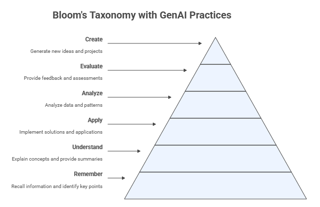

# Define Course Goals and Learning Outcomes

## Purpose

Use AI to generate, refine, align, and audit learning outcomes across cognitive levels.

**Prompt Template — Instructional + Role-Based**

```
You are a higher-education instructional designer.
Propose the course goals and generate 4–6 measurable learning outcomes for a course titled [Course Name].
Use Bloom’s taxonomy across different levels and focus on skills related to [insert skills].
Present results in a table: Outcome | Bloom Level | Example Assessment.
```

> **Note:** In the prompt above you can add or attach a course description or materials to guide the model in the creation of the learning outcomes. These contents could alternatively be added as files in your workspace (project).

**Additional Prompt Variant — Alignment Check**

```
Check whether the learning outcomes below align with Bloom’s taxonomy levels.
Identify any non-measurable verbs and suggest revisions.

[Type or paste the LO here]
```

Click on the link below to see the _Bloom's Taxonomy & GenAI Teaching Practices_ artifact generated by Claude.ai. Click on any level of Bloom's Taxonomy to explore specific GenAI teaching practices and tools that support learning at that cognitive level. Each practice is designed to enhance student engagement and deepen understanding through AI-assisted instruction. <br>
https://claude.ai/public/artifacts/b64d5dd0-17b7-40b4-81c4-67041fbf8810 <br>

**Instructional Prompt Used in Claude.ai to create the Interactive Artifact above**

```
Teaching and Learning with AI. Create a diagram of Bloom’s Taxonomy pyramid with example verbs for each level (Remember → Create), linking each level to potential GenAI teaching practices.
```


