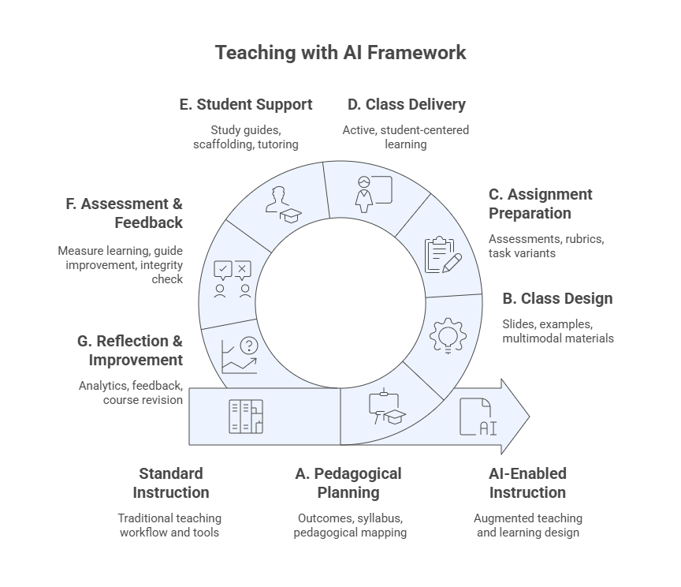
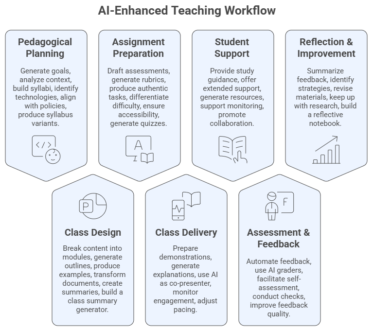
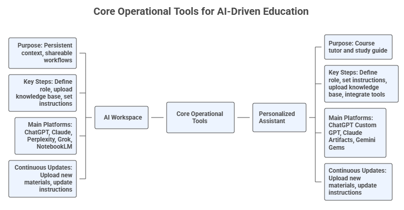

# Teaching with AI — Prompt Library

## Welcome

Welcome to the **Prompt Library for Teaching with AI**, part of the FGCU AI Academy led by the **Dendritic Institute for Human-Centered AI & Data Science at Florida Gulf Coast University**.

This library provides **ready-to-use prompts and templates** to help instructors apply Generative AI across the teaching and learning cycle — from planning and design to delivery, assessment, student support, and reflection.

Rather than focusing on theory, the Prompt Library emphasizes **practical, hands-on use of AI tools** for real instructional tasks.

## The Instrumental Augmentation of Teaching with AI

The **Teaching with AI Framework** provides a structured, operational view of how generative AI can be integrated into each phase of the teaching process. Rather than altering pedagogy, it highlights where AI can add efficiency, creativity, and support across planning, design, delivery, assessment, student support, and reflection.

This framework structures classical phases of teaching into seven parts as **AI‑supported processes**, emphasizing the *operational* integration of GenAI at each step.

This library provides a variety of prompts related with the foundation for the instrumental use of Generative AI (GenAI) across the entire teaching workflow. It is built upon the background knowledge from the **AI Literacy Program** (Prompt Engineering, Context Engineering, and Foundational Models) and the full **Teaching with AI** program of the FGCU AI Academy.  

The picture below contains a summary of the main modules of our framework and the main tools and deliverables of each step. 

---

## Structure and Approach
*A multi-layered, workflow-driven program for operational AI integration in higher education*  

The **Prompt Library for Teaching with AI** is built as a *practical, operational, and iterative set of prompts* for integrating generative AI into every phase of the teaching and learning cycle presented previously. Unlike pedagogical theory–oriented programs, this library focuses on how instructors actually use AI prompts systematically, responsibly, and efficiently within real teaching workflows.

Across eight modules, instructors progressively build two persistent tools:

- **The AI Workspace (Project)** – your *design and development environment* for planning, creating, auditing, and improving course materials. The main platforms to be used to create AI workspaces are ChatGPT, Perplexity, Claude, and Grok).
- **The Course Personalized Assistant (PA)** – your *student-facing AI tutor* for explanations, study support, and assignment clarification (without solving graded tasks). The main platforms to be used to create PAs are Custom GPTs, Claude Artifacts, Gemini Gems, and CoPilot Agents.

The entire program and library is structured as a **guided transformation of your teaching practice**, with each module updating, refining, and expanding these tools.

---

## What Is This Library For?

The Prompt Library helps instructors:

- Plan courses and class sessions
- Design materials and learning activities
- Create assignments and rubrics
- Support students with AI-assisted scaffolding
- Generate feedback and reflections
- Improve courses iteratively

Each prompt is designed to be **copy-ready and adaptable** to your own course context.

---

## How to Use the Prompts

1. Pick a task (e.g., _design a class session_).
2. Copy a prompt from the library.
3. Replace the placeholders (e.g., `[Course Title]`, `[Topic]`).
4. Run it in your AI Workspace or assistant.
5. Review and revise the output before using it in class.

> AI supports teaching — it does not replace instructor judgment.

---

## Tool Neutrality

The prompts are **model-agnostic** and work across tools such as ChatGPT, Claude, Gemini, Perplexity, NotebookLM, and others. Focus on the workflow, not the platform.

---

## Responsible Use

All prompts follow the Teaching with AI principles:

- Verify AI outputs
- Maintain academic integrity
- Protect student data
- Keep instructor and student tools separate

You remain responsible for how AI is used in your course.

---

## Get Started

Use the sidebar to explore prompt sets for:

- Planning
- Design
- Assignments
- Delivery
- Student Support
- Assessment
- Reflection

Start with **Module 1: The Teaching with AI FrameworkI**.

---

## About the Instructor – Dr. Leandro Nunes de Castro

- Professor in the **Department of Computing and Software Engineering**, U.A. Whitaker College of Engineering, FGCU.
- Ph.D. in Computer Engineering with 30 years of experience in **Artificial Intelligence, Data Science, and Natural Computing**.
- Director of the **Dendritic Institute for Artificial Intelligence and Data Science** at FGCU.
- Author of various AI and Data Science books and papers, and recognized among the **Top 2% most influential researchers in Computer Science worldwide**.
- Experienced entrepreneur, researcher, and educator with a focus on applying AI for innovation, business, and societal impact.
- Active mentor and collaborator with international academic and industry partners.

## Acknowledgements

Developed by **Dr. Leandro Nunes de Castro**©️ for the **Dendritic Institute for Human-Centered AI & Data Science**, within the **U.A. Whitaker College of Engineering at Florida Gulf Coast University**.

Content curated by the team, with support from large language models such as ChatGPT, Claude, Gemini, Perplexity, Gamma.ai, Napkin, and CoPilot, following ethical and pedagogical review.
